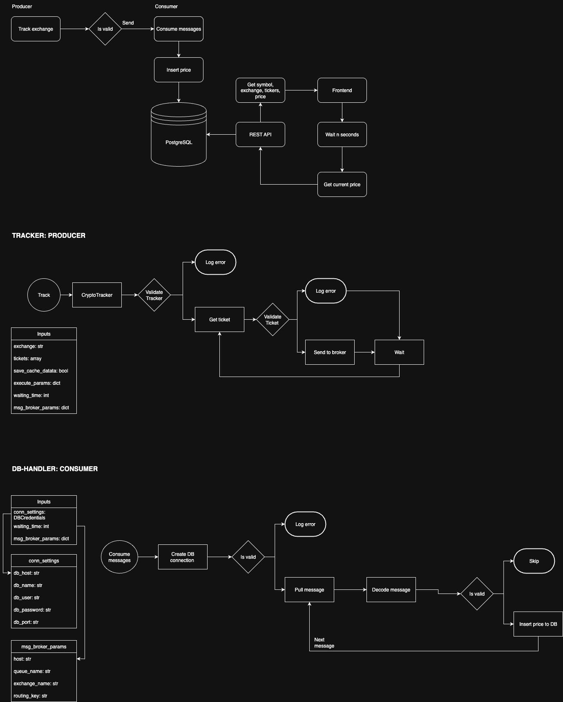
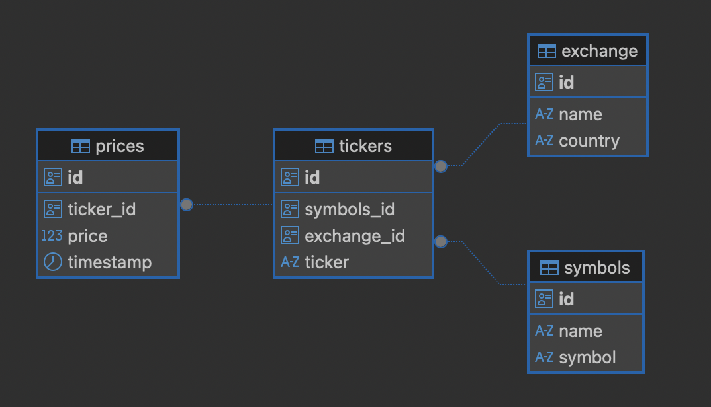

# Crypto prices tracker: Microservice approach.

The project’s main goal is to create a microservice solution as the bone of our backend so we can serve real-time data to a 
dashboard, creating a basic web application that will let us inspect the price of cryptocurrencies from different 
exchanges.

To accomplish this we must answer first how we are going to ingest the data and where we are going to store it, and how 
all the process in between is going to work. For this reason we will be creating a microservice solution in order to 
create services that can work independently of the other.

For the purposes of the project we are going to focus on ingesting Bitcoin and Ethereum prices from Binance through 
their free API, using the following URL as an example of the data we are going to be dealing with:

https://api.binance.com/api/v3/ticker/price?symbols=%5b%22BTCUSDT%22,%22ETHUSDT%22%5d

## Goals

- Create a microservice solution to handle cryptocurrency data to serve a real-time dashboard.
- Build a service that can track crypto data from a desired  exchange (e.g. Binance).
- Design a relational database capable of storing cryptocurrency data from various exchanges and multiple coins.
- Create a custom REST API that can collect data from the RDBMS.
- Build every service as independent containers to handle their orchestration.

## Technology Stack
- Python: programming language used to create both backend and frontend. Main libraries and frameworks:
    - requests: to handle HTTP requests.
    - pydantic : to handle data validation
    - psycopg2: to work as a Python-PostgreSQL adapter, to handle database connection, ACID transactions, etc.
    - Flask: micro web framework used to create custom REST APIs.
    - Streamlit: framework to build interactive data related web applications.
- PostgreSQL: relational database engine.
- RabbitMQ: message broker for services decoupling.
- Docker: application containerization and tool for multiple containers orchestration.

## Getting Started

In order to run our solution locally we must consider first the creation of the .env file, which will be accessed by 
several containers to map the secrets to our solution. However if you want to use the default variables you can run the 
bash file “create_env.sh” which will handle the creation of the environment variables in a dedicated .env file. 

Take in consideration the file must have execution permission, if not you can execute the command 
“chmod +x create_env.sh” from the project’s root directory.

After creating our environment we can move to the next step which is running our containers. Since the project requires 
several individual containers we are going to leverage on the docker-compose.yml file. For this we can use the 
“docker-compose up -d” 

*Commands to start running our application.*

```bash
chmod +x create_env.sh
./create_env.sh
docker-compose up -d
```

### .ENV Example
    #DATABASE
    POSTGRES_DB=postgres
    POSTGRES_USER=postgres
    POSTGRES_HOST=db
    POSTGRES_PORT=5432
    POSTGRES_PASSWORD=mypassword
    
    #RABBITMQ
    RABBITMQ_HOST=rabbitmq
    RABBITMQ_QUEUE_NAME=my_queue
    RABBITMQ_EXCHANGE_NAME=""
    RABBITMQ_ROUTING_KEY=my_queue
    
    #TRACKER SETTINGS
    TRACKER_SAVE_CACHED_DATA=False
    TRACKER_WAITING_TIME=10

    # FRONTEND SETTINGS
    API_HOST=http://api:5001

## Architecture
As has been described before, the application will follow a microservices approach. To accomplish this we will first 
split both our backend and frontend to handle them as independent modules, following a basic structure as the following:

- backend/
    - api/
    - database/
    - db-handler/
    - tracker/
- frontend/
    - src/



### Backend
Following the single responsibility principle, the backend is structured in various services as shown before to fulfill 
independent actions. This is the core of the application, where we will be ingesting, validating and loading our data, 
so it can be available for real-time dashboard through the custom API.

#### Tracker

This service will act as the Producer and the core of our application, where we will ingest our data from an exchange. 
In order to accomplish this we must consider dealing with different HTTPs responses from various exchanges 
(e.g. Binance, Coinbase, etc.). 

For each exchange we may have different logic, to handle this we will have a CryptoTracker class that will act as 
wrapper, where every sub-module will be a child of the parent class Tracker, to handle common methods like cache 
management and messenger, while the child i responsible of their own logic for both data ingestion and validation.

On the other hand, and following an OOP approach, we will leverage on a separate exchange_api module, that similar as 
before, will act as wrapper for several exchange connectors, handling the HTTP responses and data validation.

For the purpose of this project we only created the connection for Binance.

**Tracker structure:**

- /tracker
    - tracker/
    - exchange_api/
    - service/
    - utils/
- tracker_wrapper.py
- Dockerfile
- entrypoint.py


#### Database
This module will only act to handle our database schema creation that will be handled by the PostgreSQL docker image.

**Schema**



Some queries we could do are the following:

 ````sql
  -- GET SYMBOLS
  select s."name", s.symbol 
  from symbols s
  order by s."name";
  
  
  -- GET EXCHANGES
  select e."name", e.country 
  from exchange e
  order by e."name";
  
  -- GET TICKERS
  select t.ticker, e."name", s."name"
  from tickers t
  join exchange e on e.id = t.exchange_id 
  join symbols s  on s.id  = t.symbols_id
  where s."name" = 'bitcoin' and e."name" = 'binance'
  order by s."name";
````

#### DB-Handler
This module will act as our Consumer, where we will handle our incoming messages, decoding them and validate them in 
order to insert the new data on our database. This module as described will handle both the database connection and 
CID transactions. To accomplish this and following an OOP approach we will leverage on the parent class DBHandler, 
that will be responsible for the database authentication, connection pool creation and as our query executor.

On the other hand, we will have the class CryptoAppDBHandler that will handle the specific transactions needed to feed 
our database like the “insert_price” method, that will act as the callback function for our consume_messages function, 
that will process the received messages from our messages queue.

DB-Handler structure:

- db_handler/
    - service/
    - dbhandler/
    - message_broker/
    - utils/
- Dockerfile
- entrypoint.py 

#### API
This module will be responsible for the creation of our REST API that will be responsible for interacting with our 
database to deliver responses through HTTP requests. For the purpose of the project we only created endpoints that use 
the GET method.

As described, the API will handle their independent connection to the database and perform a SELECT query, and 
leveraging on a formatter function we will be able to deliver the desired data. The endpoints created are the following:

- /symbols: to interact with the symbols table and select all the symbols
- /exchanges: to interact with the exchange table and select all the exchanges
- /tickers/<symbol>/<exchange>: to interact with both the symbols and exchange tables to get all the tickers filtering by symbol and exchange 
- /price-history-minutes/<minutes>/<ticker>: to interact with the ticker and prices table, to get the prices of ticker from a specific timestamp and separate each every n minutes. 

##### APIs Calls Tests
    curl http://localhost:5001/symbols
    curl http://localhost:5001/exchanges
    curl http://localhost:5001/tickers/bitcoin/binance
    curl http://localhost:5001/price-history-minutes/120%20minute/BTCUSDT